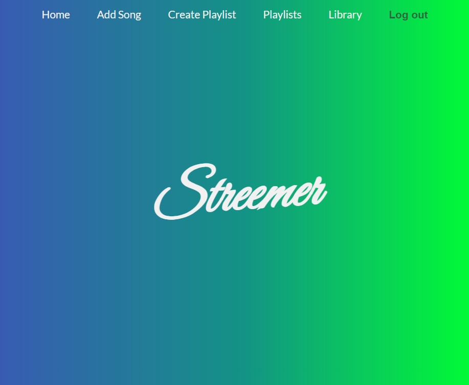

# Streemer

[Streemer](https://streemer-551873ec9fba.herokuapp.com/) is an idea for a music streaming service. It does not contain any official songs or music; however, it contains a framework to host music in the future. It allows users the ability to add songs to their library, create playlists, and more.

I built Streemer to be the foundation of a fully functional music app. I am a musician, and I want to be able to give other musicians the platform to grow and live off of their music. 

### Getting Started:

* Here is a link to deploy the app: [Streemer](https://streemer-551873ec9fba.herokuapp.com/).

* Here is a link to my planning materials: [Trello](https://trello.com/b/pR68nRJC/streemer).

### Attributions:

I did not use many outside resources for this project. I used General Assembly's documentation, the [Django documentation](https://docs.djangoproject.com/), and this [Youtube video](https://www.youtube.com/watch?v=8V-mscw6H64) to help with the login process.

### Technologies Used:
* Python
* Django
* Postgresql
* HTML5
* CSS
* GitHub
* Heroku

### Next Steps:

* Improve user authorization when visiting each page.
* Use Spotify's API to test the app with actual audio.
* Implement functionality to upload audio so users can share their music.
